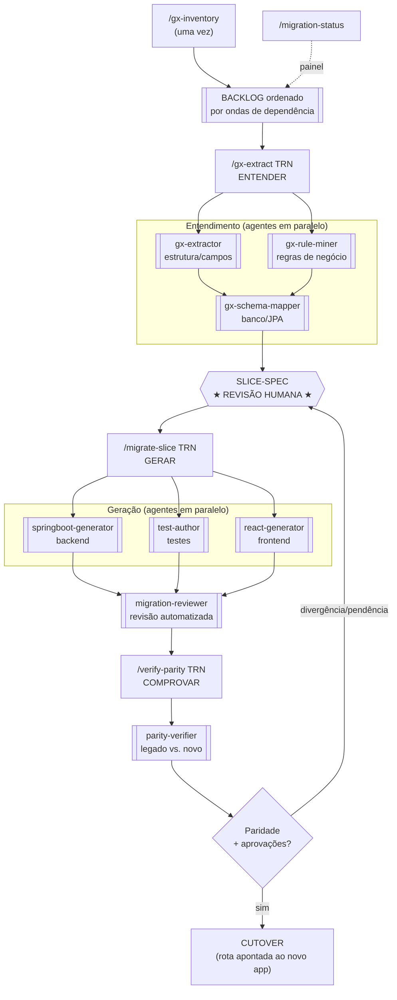

# Relatório de Progresso — Modernização do Sistema Receituário

**Cliente:** Secretaria Municipal de Saúde — Mandaguari
**Projeto:** Migração GeneXus → Spring Boot 3 (Java 21) + React/TypeScript
**Período coberto:** 10 a 22 de junho de 2026
**Documento:** Relatório executivo de andamento
**Emitido por:** **Invictus.AI**

---

## 1. Sumário executivo

O sistema legado **Receituário** (gerado em GeneXus, executando em Java/Tomcat) está sendo
reconstruído em uma arquitetura moderna (Spring Boot + React) por meio de uma estratégia de
**migração incremental "strangler-fig"**: as funcionalidades são migradas uma a uma, em ordem de
dependência, com os dois sistemas operando sobre **o mesmo banco PostgreSQL** durante a transição —
o que elimina "big bang" e permite reverter qualquer rota a qualquer momento.

Em aproximadamente **duas semanas de trabalho ativo**, foram entregues **12 funcionalidades
verificadas** (prontas para corte de produção), **1 funcionalidade-chave concluída e testada**
(Profissionais), além de uma **"fábrica" de automação** que padroniza e acelera cada nova migração.
Toda a base está coberta por **512 testes automatizados** (100% verdes) e por verificação de
**paridade comportamental** contra o sistema legado.

> **Estado atual:** ~35% das transações já migradas e verificadas — concentradas na fundação
> (tabelas de apoio, catálogo de medicamentos, unidades, especialidades). As etapas mais complexas
> e sensíveis (autenticação, pacientes e o **receituário de controle especial — Portaria 344/98**)
> permanecem à frente e dependem também de **aprovações regulatórias e de proteção de dados**.

---

## 2. O que foi entregue

### 2.1. Funcionalidades migradas e **verificadas** (12)

| Onda | Funcionalidade | Transação | Complexidade |
|------|----------------|-----------|--------------|
| 1 | Conselho de Classe | SAU_CONCLA | Pequena |
| 1 | Local | SAU_LOC | Pequena |
| 1 | Tipos de Medicamento | SAU_TIPREM | Pequena |
| 1 | Bairro | SAU_BAI | Pequena |
| 1 | Posologia | SAU_REMOBS | Média |
| 2 | Distrito Sanitário | SAU_DIS | Média |
| 2 | Especialidades | SAU_ESP | Média |
| 2 | Impedimento do Profissional | SAU_IMP | Média |
| 2 | Setor da Unidade | SAU_UNISETOR | Média |
| 2 | Unidade de Atendimento | SAU_UNI | Muito grande |
| 3 | Medicamento | SAU_REM | Grande |
| 3 | Aprovação de Medicamento | SAU_APRREM | Pequena |

"Verificada" significa: backend + frontend + testes gerados, suíte automatizada verde e
**paridade comportamental confirmada** contra o sistema legado (mesmas regras, mesmos resultados).

### 2.2. Funcionalidade-chave concluída e testada (1)

- **Profissionais (SAU_PRO)** — o cadastro do **prescritor**. Migrada de ponta a ponta, com
  **paridade 13/13** confirmada. Está em estágio **"testado"** (não "verificado") porque o corte de
  produção depende de **assinaturas regulatórias e de proteção de dados** (ver §7). Durante esta
  migração foram identificadas e tratadas questões de segurança relevantes — incluindo o achado de
  que o sistema legado armazena **a senha do certificado digital em texto puro** (corrigido na nova
  implementação com criptografia em repouso e exclusão total da API).

### 2.3. A "fábrica de migração" (ativo reutilizável)

Mais do que código, foi construída uma **linha de produção automatizada** — um conjunto de comandos
e agentes especializados que executam cada migração de forma padronizada, auditável e rápida
(detalhada em §4 e §5). Inclui também um comando único para **subir todo o ambiente** (`/dev-stack`).

### 2.4. Métricas de qualidade

| Indicador | Valor |
|-----------|-------|
| Funcionalidades verificadas | **12** (+1 testada) |
| Testes automatizados (backend) | **512**, 100% verdes |
| Defeitos reais encontrados pela automação e já corrigidos | **6+** (ex.: tipos de coluna, filtros SQL, estouro de campo criptografado) |
| Achados de segurança tratados | senha de certificado em texto puro; auditoria com identificador correto; nenhum dado sensível exposto em API |
| Regressões introduzidas | **0** |

---

## 3. Tempo e esforço

**Janela de desenvolvimento ativo:** 10 a 22 de junho de 2026 (≈ 2 semanas), incluindo a montagem do
esqueleto do projeto, a fatia de referência e as 13 fatias acima.

A automação reduz drasticamente o tempo por funcionalidade. Tempos **reais de execução** observados
na fatia-chave Profissionais (a mais complexa até aqui), por etapa:

| Etapa (comando) | Tempo de máquina | Observação |
|-----------------|------------------|------------|
| Entendimento (`/gx-extract`) | **~15 min** | extração + mineração de regras + mapeamento de banco |
| Geração + testes (`/migrate-slice`) | **~31 min** | backend, frontend e testes gerados em paralelo + revisão |
| Verificação de paridade (`/verify-parity`) | **~19 min** | 13 cenários contra dados reais (cópia não-produtiva) |
| **Total da fatia-chave** | **≈ 65 min** | fora o tempo de revisão humana |

As funcionalidades de apoio (cadastros simples) levam apenas **alguns minutos** de execução cada.
Em termos práticos, a cadência sustentável tem sido de **várias funcionalidades migradas e
verificadas por dia útil**, sendo o gargalo a **revisão humana** das regras de negócio e as
**aprovações** — não a geração de código.

---

## 4. A linha de produção: comandos e fluxograma

A migração de cada funcionalidade percorre um **pipeline de cinco comandos**. Cada comando tem um
papel único e produz um artefato revisável antes de avançar:

| Comando | O que faz |
|---------|-----------|
| `/gx-inventory` | Mapeia **todas** as transações do sistema legado e as ordena em "ondas" por dependência (executado uma vez). |
| `/gx-extract <TRN>` | **Entende** uma transação: extrai campos, chaves e regras de negócio do código legado, e mapeia o banco. Produz uma **especificação revisável** (a "SLICE-SPEC") — **não gera código ainda**. |
| `/migrate-slice <TRN>` | **Gera** backend (Spring Boot), frontend (React) e a suíte de testes a partir da especificação aprovada; depois faz uma revisão automatizada. |
| `/verify-parity <TRN>` | **Comprova** que a nova funcionalidade se comporta como a legada (mesmos resultados para as mesmas entradas), antes do corte. |
| `/migration-status` | Painel de progresso (somente leitura): situação de cada transação e próxima recomendada. |
| `/dev-stack` | Sobe/desce todo o ambiente local (banco + backend + frontend) com um comando. |

### Fluxograma do processo

> **Ponto de controle humano:** a SLICE-SPEC (★) é sempre revisada por uma pessoa **antes** de
> qualquer código ser gerado. As regras de negócio recuperadas vêm com **citação da linha de origem**
> no código legado e um **nível de confiança**, garantindo auditabilidade e evitando "invenção" de
> regras.

---

## 5. Como funciona o paralelismo de agentes

A fábrica não é um único programa monolítico: é uma **equipe de agentes de IA especializados**,
coordenados por um agente orquestrador. Cada agente domina uma tarefa estreita (entender estrutura,
minerar regras, gerar backend, escrever testes, verificar paridade) e **vários deles trabalham ao
mesmo tempo** quando não há dependência entre eles.

- **No entendimento (`/gx-extract`):** o `gx-extractor` (estrutura) e o `gx-rule-miner` (regras de
  negócio) rodam **simultaneamente** sobre o código legado; em seguida o `gx-schema-mapper` mapeia o
  banco. Resultado: o tempo total ≈ o do agente mais lento, e não a soma de todos.
- **Na geração (`/migrate-slice`):** assim que a especificação está "congelada", o **backend**, o
  **frontend** e os **testes** são produzidos por três agentes **em paralelo**; só então um agente
  **revisor** confere o conjunto.
- **Benefício concreto:** na fatia Profissionais, a fase de geração levou ~31 min de relógio em vez
  de ~46 min se fosse sequencial — e os agentes ainda **encontraram e corrigiram defeitos reais**
  uns dos outros (ex.: os testes expuseram um campo criptografado que estourava o tamanho da coluna).
- **Verificação adversarial:** nas etapas de verificação, achados são confrontados de forma
  independente antes de serem aceitos, reduzindo "falsos positivos".

Em resumo: **paralelismo onde é seguro, sequência onde há dependência, e revisão humana nos pontos
críticos.** É isso que permite alta velocidade **sem** abrir mão de rastreabilidade e qualidade.

---

## 6. O que falta e estimativa de prazo

Restam aproximadamente **20 transações**, concentradas nas camadas mais complexas e sensíveis. A
estimativa abaixo assume a **mesma equipe e cadência atuais** e trata as **aprovações regulatórias
como o principal fator de prazo** (não o esforço de engenharia).

| Bloco | Conteúdo | Estimativa* |
|-------|----------|-------------|
| **Concluir Profissionais** | Assinaturas de DPO/jurídico + regulatório; tornar enforçáveis as travas de exclusão | ~1 semana (após aprovações) |
| **Onda 0 — Autenticação e Auditoria** | Login real (substituir o stub), perfis/permissões (RBAC), trilha de auditoria persistente (LGPD) — SAU_USU, SAU_PRF, SAU_PRFCON, SAU_USUCON, SAU_LOG, SAU_FUN… | ~2–3 semanas |
| **Onda 4 — restante de Profissionais** | Especialidade do Profissional, Pessoa Física, Profissional Externo | ~1 semana |
| **Onda 5 — Parâmetros e vínculos** | Parâmetros (ambulatorial/geral), CNS do paciente, Usuário×Unidade | ~1–1,5 semana |
| **Ondas 6/7 — Paciente e Receituário** | **Paciente** (núcleo, muito grande) e **Receituário de Controle Especial** (Portaria 344/98) | ~3–4 semanas + prazo regulatório |
| **Corte de produção (cutover)** | Validação de dados, troca de rotas, treinamento e acompanhamento | ~1–2 semanas |

\* Estimativas de engenharia. Faixas, não compromissos contratuais.

**Conclusão funcional estimada:** aproximadamente **2 a 3 meses** para feature-completo + corte de
produção, **condicionada às aprovações** de proteção de dados (LGPD) e regulatória (Portaria 344/98),
que podem ser o verdadeiro caminho crítico do cronograma.

---

## 7. Riscos e dependências (atenção da gestão)

1. **Regulatório — Portaria 344/98 (controlados):** o Receituário de Controle Especial (SAU_RECESP)
   exige **parecer regulatório** antes do corte. Recomenda-se iniciar esse trâmite **desde já**, em
   paralelo à engenharia, para não virar gargalo.
2. **LGPD / dados sensíveis:** o sistema lida com dados de saúde (PHI). Já foram tratados achados
   importantes (ex.: **senha de certificado em texto puro** no legado). É necessária a validação do
   **Encarregado de Dados (DPO)** sobre o esquema de criptografia e o controle de acesso aos
   certificados/assinaturas digitais dos prescritores.
3. **Autenticação legada:** o login atual é provisório (de desenvolvimento). A migração do esquema de
   senhas do sistema legado (Onda 0) é pré-requisito para produção e para liberar verificações
   pendentes em Profissionais.
4. **Dados de origem:** as cargas de paridade são feitas sobre **cópia não-produtiva**; o corte final
   pressupõe uma janela de validação de dados com a equipe da Secretaria.

---

## 8. Recomendações / próximos passos

1. **Iniciar o trâmite regulatório (Portaria 344/98)** e a **revisão do DPO** imediatamente — são os
   itens de maior prazo e independem da engenharia.
2. **Avançar a Onda 0 (autenticação + auditoria)** como próxima prioridade técnica: destrava o login
   real, o controle de acesso e a trilha de auditoria exigida pela LGPD.
3. **Concluir Profissionais → "verificado"** assim que as aprovações forem emitidas.
4. Manter a cadência atual da fábrica para as Ondas 4 e 5 (baixo risco, alto rendimento).

---

### Encerramento

Em duas semanas, o projeto saiu do zero para uma **fundação migrada, testada e comprovadamente
equivalente ao legado**, sustentada por uma linha de produção automatizada que torna cada próxima
funcionalidade mais rápida e segura de entregar. O caminho à frente é claro e priorizado; o principal
fator de prazo passa a ser **as aprovações regulatórias e de proteção de dados**, que recomendamos
acionar de imediato.

 

—
**Invictus.AI**
Engenharia de Modernização de Sistemas
Relatório emitido em 22 de junho de 2026
